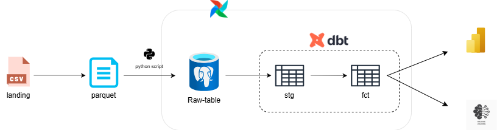

# ETL-crime-data-from-2020-to-present-using-dbt-and-postgres

This repo is used for praticing in Data engineering, including ingest data, transform with dbt, and orchestrate with airflow

## Architecture

## Data source
https://www.kaggle.com/datasets/qnqfbqfqo/crime-data-from-2020-to-present/